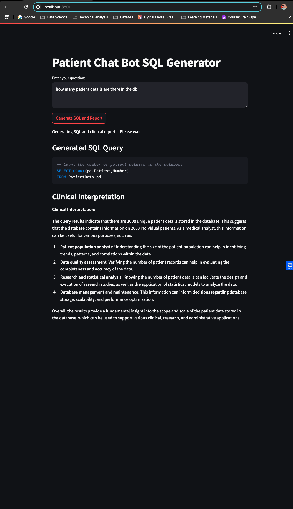

# patient_info_chatbot

## To Setup in Local

1. **Clone the repository** 
  ```bash
  https://github.com/vishnuap-ai-works/patient_info_chatbot.git
```
2. **Create the shared network and volume** 
  ```bash
# create the bridge network
docker network create app-network

# create the Ollama data volume
docker volume create ollama_data

```
3. **Build your FastAPI (BackEnd) and Streamlit (FrontEnd) images** 
  ```bash
# Build the FastAPI image (uses Dockerfile in project root)
docker build -t fastapi-app .

# Build the Streamlit image (uses ui/Dockerfile)
docker build -t streamlit_app ./ui

```
4. **[Optional - For local LLM Setup] Run ollama-sqlcoder** 
  ```bash
docker run -d \
  --name ollama-sqlcoder \
  -p 11434:11434 \
  --network app-network \
  -v ollama_data:/root/.ollama \
  --entrypoint /bin/sh \
  ollama/ollama \
  -c "ollama serve & sleep 5; ollama pull sqlcoder:15b-q8_0; wait"
```

5. **Run fastapi-app (BackEnd)** 
  ```bash
docker run -d \
  --name fastapi-app \
  -p 8000:8000 \
  --network app-network \
  -e GROQ_API_KEY=<YOUR_API_KEY> \
  -v "$PWD":/app \
  fastapi-app
```
6. **Run streamlit (FrontEnd)** 
  ```bash
docker run -d \
  --name streamlit_app \
  -p 8501:8501 \
  --network app-network \
  -e FASTAPI_HOST=fastapi-app \
  streamlit_app
```

## UI Image

